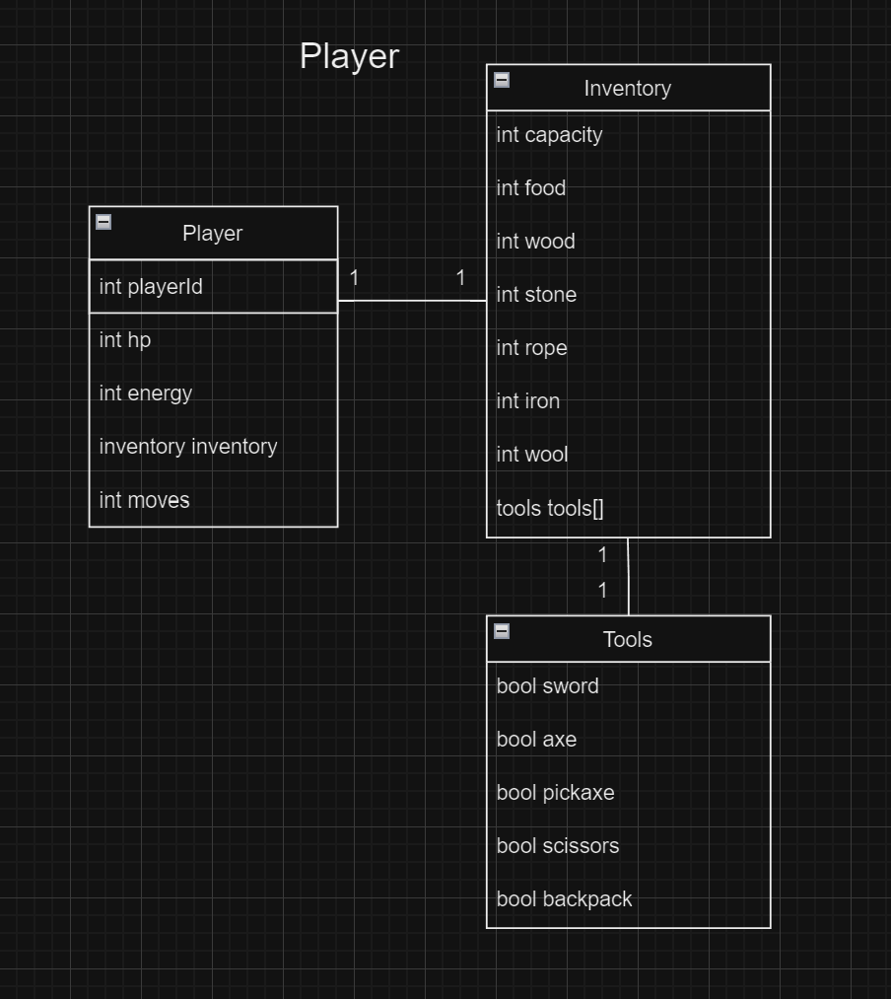
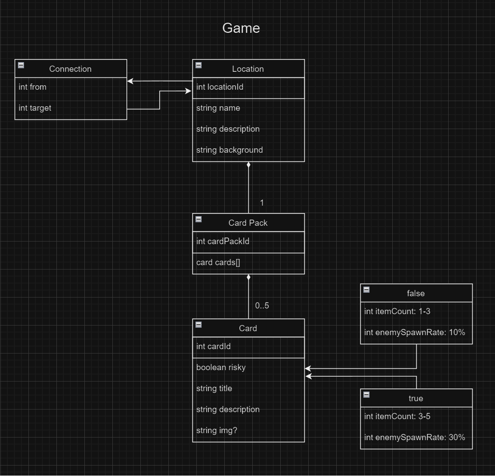

# Lost on Island
## Diagramy

## Myšlenka hry
Jste na opuštěném ostrově a vašim cílem je, přežít a dostat se z ostrova (postavit loď) v co nejméně tazích. Jedná se o strategickou hru kdy je důležité brát v potaz náhodnost karet a přizpůsobit tak svou strategii v průběhu hry.
## Herní mechanika
### Tahání karet
Každá lokace na mapě má vlastní speciální balíček karet ze kterého si hráč může náhodně vytáhnout kartu. Každá karta má svou pravděpodobnost na padnutí a na množství itemů které nám dá.
### Tahy
Každá změna lokace nebo vytáhnutí karty nám přidá 1 tah. Hráč je tak nucen si rozumně vybírat své nadcházející kroky chce-li dokončit hru v co nejméně tazích.
### Stavba lodě
Postavit loď je primárním cílem hráče. Loď se staví podle přesně daného postupu a množství materiálů. Hráč je tak nucen vždy přijít s dostatkem materiálů každého druhu pro to aby mohl vylepší úroveň své lodi. Jakmile je loď dokončena, hráč dohrál hru.
### Nepřátelé
V průběhu hry se v kartách mohou naskytnout nepřátelé v podobě zvířat jako je divoké prase, vlk, pakouk nebo had. Tito nepřátelé nám dají určitý úkol který musíme splnit. Jestliže úkol nesplníme uberou nám více životů než obvykle. Nepřítel vždy ubere určitý materiál / životy.
### Karty
Každá karta přidává určité množství itemů podle lokace.
### Riskantní karty
Riskantní karty mají vyšší šansi na spawnutí nepřátele, za to ale dávají více itemů.
### Smrt
Smrt nadejde v moment kdy hráč ztratí všechnu energii anebo životy.
### Mapa a změna lokace
Hráč na mapě může změnit lokaci podle aktuální pozice. Každá změna ho stojí 1 tah.
## Lokace
**Pláž**
- Stavba lodi, kokos, úpal
**Les**
- dřevo, bobule, divoké prase
**Hluboký les**
- lano, více dřeva, vlk, pavouk
**Louka**
- zajíc, srnka, ovce, divoké prase
**Jeskyně**
- kameny, železo, pavouk, had
## Hráč
### Inventář
Hráč má defaultně určitý limit množství itemů každého druhu.
### Životy
Hráč má 20 životů o které může přijít. Když mu dojdou životy, prohrává. Životy přibývají spankem nebo tahy. (každý 2. tah získá 1 život)
### Energie
Každý tah stojí hráče 1 energii. Energie se dá získat spánkem nebo jídlem.
## Itemy
### Nástroje
Nástroje se dají vyrobit z předem získaných předmětů
- Meč - pro nepřátele, snižuje efekt
- Sekera - přidává množství získaného dřeva
- Krumpáč - přidává množství získaného kamene a železa
- Batoh - zvyšuje limit itemů v inventáři
- Nůžky - Na získání vlny z ovcí
### Materiály
Seznam materiálů, které můžeme získat.
- Jídlo (obecně)
- Dřevo
- Lano
- Vlna
- Kámen
- Železo

# Figma

<a href="https://www.figma.com/file/HgapxBxLe2iR5RIlQ6MPy0/Explorer-RPG?type=design&node-id=9-2&mode=design&t=u99HK53qjscsTZYJ-0">Figma Design Link</a>

